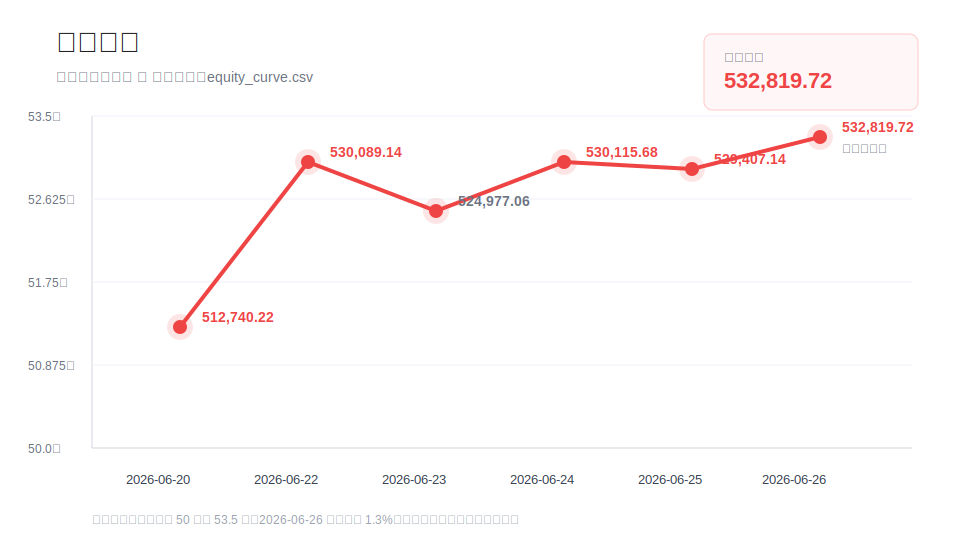

# 资金曲线

## 数据表

资金曲线原始数据记录在：

`equity_curve.csv`

## 当前记录

| 日期 | 总资产 | 总市值 | 现金 | 仓位 | 总盈亏 | 当日盈亏 | 当日盈亏比例 |
|---|---:|---:|---:|---:|---:|---:|---:|
| 2026-06-20 | 512,740.22 | 368,501.00 | 144,239.22 | 71.9% | 50,964.62 | 9,872.62 | 1.96% |
| 2026-06-22 | 530,089.14 | 211,259.00 | 318,830.14 | 39.9% | 68,313.54 | 17,559.84 | 3.43% |
| 2026-06-23 | 524,977.06 | 157,544.00 | 367,424.50 | 30.0% | 39,611.76 | -4,958.12 | -0.94% |
| 2026-06-24 | 530,115.68 | 131,909.84 | 398,201.84 | 24.9% | 16,546.86 | 5,289.14 | 1.01% |
| 2026-06-25 | 529,407.14 | 86,155.72 | 443,247.42 | 16.3% | 18,849.44 | -650.37 | -0.12% |
| 2026-06-26 | 532,819.72 | 6,972.00 | 525,847.72 | 1.3% | 22,098.92 | 3,523.12 | 0.67% |

## 最新变化

- 资金曲线从 2026-06-25 的 529,407.14 回升到 532,819.72。
- 2026-06-26 当日参考盈亏为 +3,523.12，账户收益率 +0.67%。
- 仓位大幅下降：从 16.3% 降到 1.3%，账户基本空仓过周末。
- 今日质量：上证 -2.26%、创业板 -4.07% 的系统性大跌日，账户仍实现正收益；主要来自主动清仓长电科技、麦捷科技、大族激光，仅保留沪硅产业 200 股观察仓。

## 维护规则

每日收盘后追加一行：

- 总资产；
- 总市值；
- 可用资金；
- 仓位；
- 总盈亏；
- 当日盈亏；
- 当日盈亏比例；
- 当日备注。

后续可基于 `equity_curve.csv` 生成资金曲线图、回撤曲线、胜率统计和月度复盘。
