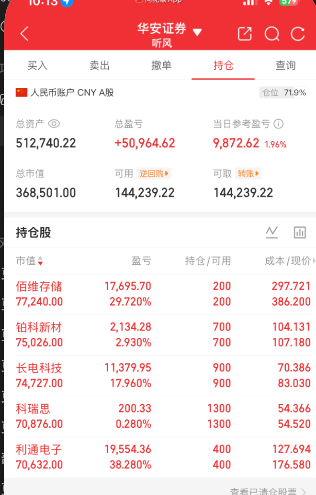

# 2026-06-20 持仓快照

截图来源：华安证券持仓页  
截图时间：2026-06-20  
账户类型：人民币账户 CNY A股  

## 账户概览

| 项目 | 数值 |
|---|---:|
| 总资产 | 512,740.22 |
| 总盈亏 | +50,964.62 |
| 当日参考盈亏 | +9,872.62 |
| 当日参考盈亏比例 | +1.96% |
| 总市值 | 368,501.00 |
| 可用资金 | 144,239.22 |
| 可取资金 | 144,239.22 |
| 仓位 | 71.9% |

## 持仓明细

| 股票 | 市值 | 盈亏 | 盈亏比例 | 持仓 | 成本 | 现价 |
|---|---:|---:|---:|---:|---:|---:|
| 佰维存储 | 77,240.00 | 17,695.70 | 29.720% | 200 | 297.721 | 386.200 |
| 铂科新材 | 75,026.00 | 2,134.28 | 2.930% | 700 | 104.131 | 107.180 |
| 长电科技 | 74,727.00 | 11,379.95 | 17.960% | 900 | 70.386 | 83.030 |
| 科瑞思 | 70,876.00 | 200.33 | 0.280% | 1300 | 54.366 | 54.520 |
| 利通电子 | 70,632.00 | 19,554.36 | 38.280% | 400 | 127.694 | 176.580 |

## 持仓结构观察

当前持仓明显偏科技成长和 AI 硬件链，主要覆盖：

- 存储：佰维存储；
- 磁性材料/电感：铂科新材；
- 半导体封测：长电科技；
- 电子制造/精密结构相关：科瑞思；
- AI 服务器/液冷/电子链相关：利通电子。

组合特征：

- 科技属性高，弹性强；
- 总仓位约 71.9%，属于中高仓位；
- 已有较大浮盈，尤其利通电子、佰维存储、长电科技；
- 如果下周一日韩及 AI 硬件链波动扩散，组合短线波动会比较大；
- 可用资金 14.42 万，仍有较好的机动空间。

## 风险点

1. 持仓方向集中在科技成长，若 AI 硬件链集体调整，组合回撤会同步放大。
2. 利通电子、佰维存储、长电科技浮盈较厚，若市场转弱，容易成为保护利润的优先处理对象。
3. 仓位 71.9%，若周一指数低开且科技线弱修复，应先控制回撤，而不是继续加仓。

## 下周一应对

### 1. 开盘不追高

周一先观察 30 到 60 分钟，不在集合竞价和开盘情绪最乱的时候加仓。

### 2. 浮盈仓先保护利润

重点观察：

- 利通电子；
- 佰维存储；
- 长电科技。

如果低开后不能快速收回开盘价，或者放量跌破短期均线，应先减一部分交易仓。

### 3. 低浮盈仓看承接

铂科新材、科瑞思浮盈较低，处理上更看个股承接和板块强弱。

如果它们没有明显破位，不必机械卖出；如果科技线整体走弱，则跟随组合一起降风险。

### 4. 仓位预案

- 科技线强修复：维持 7 成左右仓位，择强留弱；
- 科技线分化：降到 5 到 6 成，保留最强票；
- 科技线集体低开低走：降到 4 到 5 成，优先保护利润；
- 指数和科技线共振大跌：不补仓，先等下午或次日确认。

