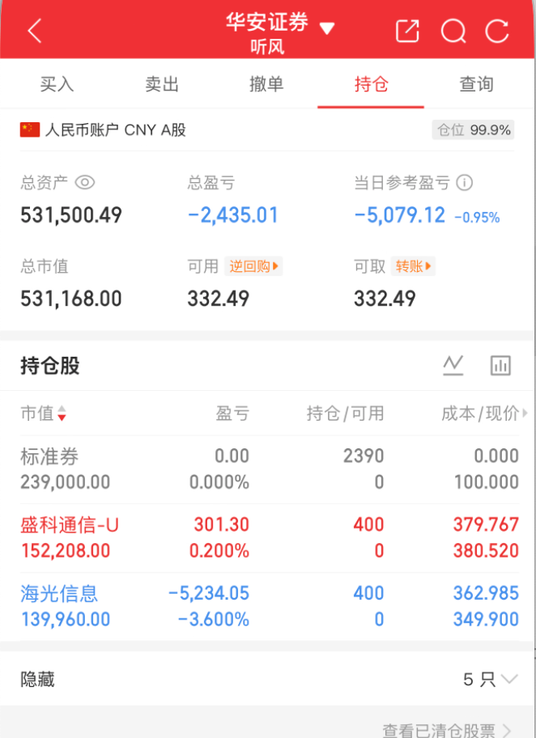

# 2026-07-01 持仓快照

生成日期：2026-07-01  
数据来源：华安证券持仓截图。  
账户状态：券商显示仓位 99.9%，实际股票波动仓位约 55.0%。  
文档属性：账户持仓记录。

## 目录

- [一、账户概览](#一账户概览)
- [二、仓位拆解](#二仓位拆解)
- [三、持仓明细](#三持仓明细)
- [四、截图留档](#四截图留档)

## 一、账户概览

| 项目 | 数值 |
|---|---:|
| 总资产 | 531,500.49 |
| 总市值 | 531,168.00 |
| 可用资金 | 332.49 |
| 可取资金 | 332.49 |
| 券商显示仓位 | 99.9% |
| 总盈亏 | -2,435.01 |
| 当日参考盈亏 | -5,079.12 |
| 当日参考收益率 | -0.95% |

## 二、仓位拆解

| 类型 | 金额 | 占总资产比例 | 说明 |
|---|---:|---:|---|
| 标准券 | 239,000.00 | 45.0% | 计入市值和券商仓位，但不等同于股票波动敞口 |
| 股票仓位 | 292,168.00 | 55.0% | 盛科通信-U、海光信息 |
| 可用资金 | 332.49 | 0.1% | 机动资金几乎为零 |

今天券商显示 99.9% 仓位，但并不是普通股票满仓。真正需要承担波动的是约 55.0% 的股票仓位；同时，因为可用资金只有 332.49，明天如果要调整，只能通过卖出释放机动资金。

## 三、持仓明细

| 股票 | 代码 | 市值 | 持有 | 成本 | 现价 | 盈亏 | 盈亏比例 |
|---|---|---:|---:|---:|---:|---:|---:|
| 标准券 | 标准券 | 239,000.00 | 2390 | 0.000 | 100.000 | 0.00 | 0.000% |
| 盛科通信-U | 688702 | 152,208.00 | 400 | 379.767 | 380.520 | +301.30 | +0.200% |
| 海光信息 | 688041 | 139,960.00 | 400 | 362.985 | 349.900 | -5,234.05 | -3.600% |

## 四、截图留档

