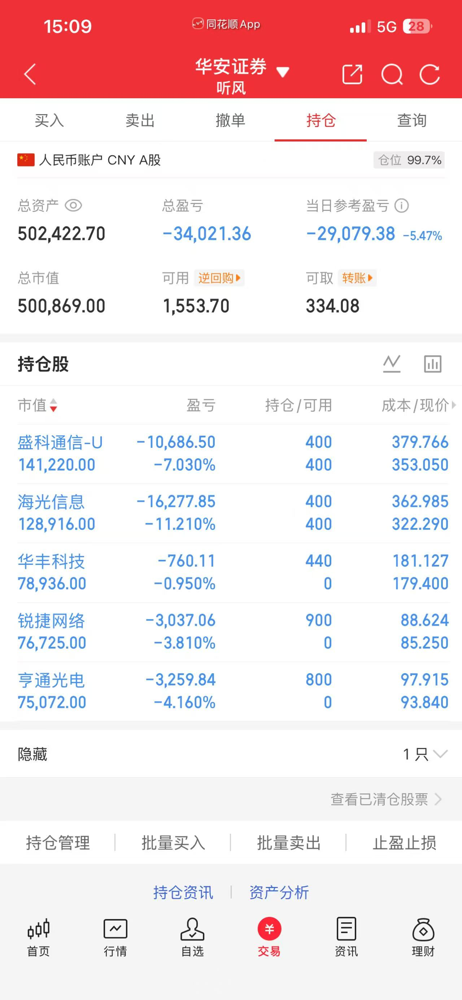

# 2026-07-02 持仓快照

生成日期：2026-07-02  
数据来源：华安证券收盘持仓截图。  
账户状态：券商显示仓位 99.7%，实际股票波动仓位约 99.7%。  
文档属性：账户持仓记录。

## 目录

- [一、账户概览](#一账户概览)
- [二、仓位拆解](#二仓位拆解)
- [三、持仓明细](#三持仓明细)
- [四、截图留档](#四截图留档)

## 一、账户概览

| 项目 | 数值 |
|---|---:|
| 总资产 | 502,422.70 |
| 总市值 | 500,869.00 |
| 可用资金 | 1,553.70 |
| 可取资金 | 334.08 |
| 券商显示仓位 | 99.7% |
| 总盈亏 | -34,021.36 |
| 当日参考盈亏 | -29,079.38 |
| 当日参考收益率 | -5.47% |

## 二、仓位拆解

| 类型 | 金额 | 占总资产比例 | 说明 |
|---|---:|---:|---|
| 股票仓位 | 500,869.00 | 99.7% | 五只股票均为科技/AI硬件相关风险因子 |
| 可用资金 | 1,553.70 | 0.3% | 几乎没有机动资金 |

今天账户已经接近满仓股票风险敞口。和 2026-07-01 的“标准券占位”不同，今天截图里可见市值全部来自股票，真实波动风险接近券商显示仓位。

## 三、持仓明细

| 股票 | 代码 | 市值 | 持有/可用 | 成本 | 现价 | 盈亏 | 盈亏比例 |
|---|---|---:|---:|---:|---:|---:|---:|
| 盛科通信-U | 688702 | 141,220.00 | 400/400 | 379.766 | 353.050 | -10,686.50 | -7.030% |
| 海光信息 | 688041 | 128,916.00 | 400/400 | 362.985 | 322.290 | -16,277.85 | -11.210% |
| 华丰科技 | 688629 | 78,936.00 | 440/0 | 181.127 | 179.400 | -760.11 | -0.950% |
| 锐捷网络 | 301165 | 76,725.00 | 900/0 | 88.624 | 85.250 | -3,037.06 | -3.810% |
| 亨通光电 | 600487 | 75,072.00 | 800/0 | 97.915 | 93.840 | -3,259.84 | -4.160% |

## 四、截图留档

