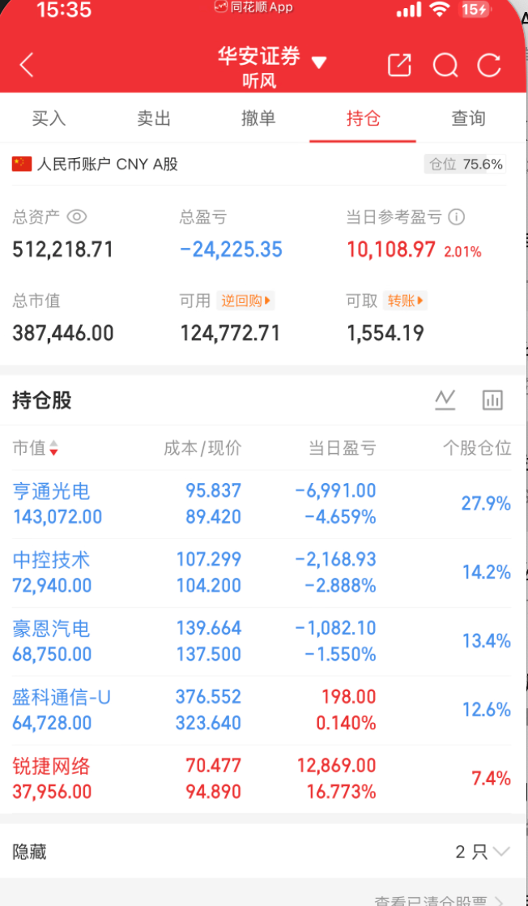

# 2026-07-03 持仓快照

生成日期：2026-07-03  
数据来源：华安证券收盘持仓截图。  
账户状态：券商显示仓位 75.6%，股票市值 387,446.00 元，可用资金 124,772.71 元。  
文档属性：账户持仓记录。

## 目录

- [一、账户概览](#一账户概览)
- [二、仓位拆解](#二仓位拆解)
- [三、持仓明细](#三持仓明细)
- [四、截图留档](#四截图留档)

## 一、账户概览

| 项目 | 数值 |
|---|---:|
| 总资产 | 512,218.71 |
| 总市值 | 387,446.00 |
| 可用资金 | 124,772.71 |
| 可取资金 | 1,554.19 |
| 券商显示仓位 | 75.6% |
| 总盈亏 | -24,225.35 |
| 当日参考盈亏 | +10,108.97 |
| 当日参考收益率 | +2.01% |

## 二、仓位拆解

| 类型 | 金额 | 占总资产比例 | 说明 |
|---|---:|---:|---|
| 股票仓位 | 387,446.00 | 75.6% | 从 2026-07-02 的接近满仓降至中高仓位 |
| 可用资金 | 124,772.71 | 24.4% | 恢复了一定机动性，但仍不是轻仓 |

今天账户从昨日极端满仓状态降到 75.6%，这是进步；但 75.6% 仍然属于中高风险仓位，且前四大持仓仍集中在光通信、机器人、超节点、AI硬件扩散方向，同风险因子没有完全解除。

## 三、持仓明细

| 股票 | 代码 | 市值 | 持有/可用 | 成本 | 现价 | 当日盈亏 | 当日盈亏比例 | 个股仓位 |
|---|---|---:|---:|---:|---:|---:|---:|---:|
| 亨通光电 | 600487 | 143,072.00 | 1600/0 | 95.837 | 89.420 | -6,991.00 | -4.659% | 27.9% |
| 中控技术 | 688777 | 72,940.00 | 700/0 | 107.299 | 104.200 | -2,168.93 | -2.888% | 14.2% |
| 豪恩汽电 | 301488 | 68,750.00 | 500/0 | 139.664 | 137.500 | -1,082.10 | -1.550% | 13.4% |
| 盛科通信-U | 688702 | 64,728.00 | 200/0 | 376.552 | 323.640 | +198.00 | +0.140% | 12.6% |
| 锐捷网络 | 301165 | 37,956.00 | 400/0 | 70.477 | 94.890 | +12,869.00 | +16.773% | 7.4% |

## 四、截图留档

