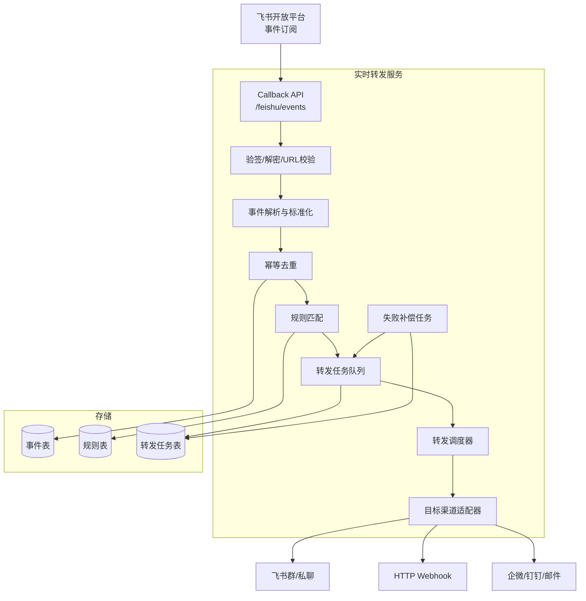
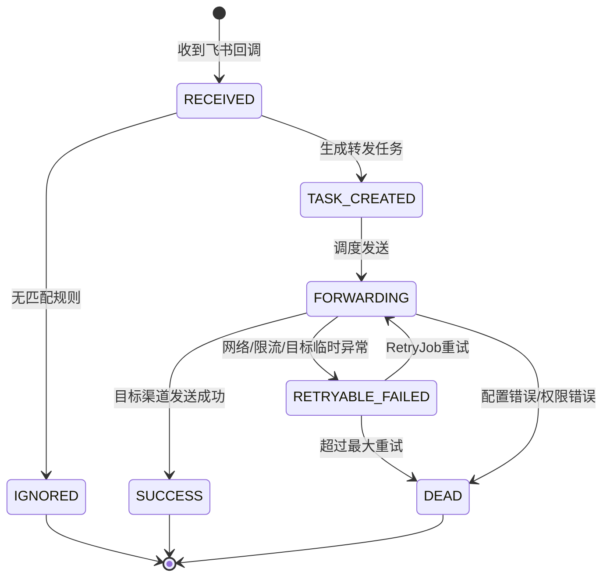
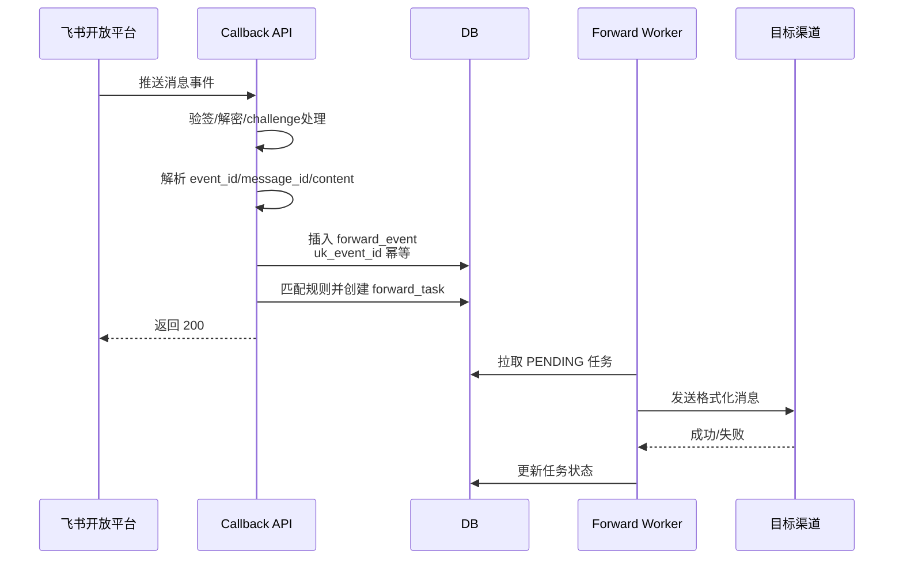

# 飞书实时内容转发程序详细设计

## 设计背景

当前目标是对飞书中的指定内容进行实时转发，降低人工复制、遗漏和延迟。程序采用飞书开放平台事件订阅接收消息事件，服务端完成验签、解密、规则匹配、去重、转发和失败补偿。

本文档范围：飞书消息实时转发服务。暂不覆盖飞书客户端插件、历史消息全量同步、绕过飞书权限读取未授权会话等能力。

参考官方文档：

- 飞书接收消息事件：<https://open.feishu.cn/document/server-docs/im-v1/message/events/receive>
- 飞书事件订阅概览：<https://open.feishu.cn/document/server-docs/event-subscription-guide/overview>

## 功能点与优先级

| 功能编号 | 功能描述 | 优先级 | 备注 |
|---|---|---:|---|
| F-01 | 接收飞书事件订阅回调，完成 URL 校验、验签和解密 | P0 | 上线必须 |
| F-02 | 订阅并处理飞书消息事件，如文本、富文本、图片、文件等 | P0 | 先支持文本和富文本 |
| F-03 | 根据群、发送人、关键词、消息类型做转发规则匹配 | P0 | 支持白名单和黑名单 |
| F-04 | 将消息转发到目标渠道 | P0 | 目标可为飞书群、企业微信、钉钉、Webhook、邮件等 |
| F-05 | 幂等去重，避免飞书重试或程序重试导致重复转发 | P0 | 以 event_id/message_id 建唯一键 |
| F-06 | 失败重试和补偿任务 | P1 | 防止目标渠道短暂异常丢消息 |
| F-07 | 管理后台或配置文件维护转发规则 | P1 | 初版可先用 YAML/数据库 |
| F-08 | 日志、指标、告警 | P1 | 监控回调延迟、失败率、积压量 |

## 一、模块职责与架构边界

### 1.1 模块职责

| 职责 | 归属方 | 说明 |
|---|---|---|
| 飞书事件订阅配置 | 飞书开放平台 + 本服务 | 在飞书应用后台配置事件请求地址、Verification Token、Encrypt Key |
| 回调接入、解密、验签 | 本服务 | 过滤非法请求，处理 challenge 校验 |
| 消息解析与标准化 | 本服务 | 将飞书消息转为内部统一 MessageEvent |
| 转发规则匹配 | 本服务 | 判断是否需要转发、转发到哪里、如何格式化 |
| 目标渠道发送 | 本服务适配器 | 每个渠道一个 Adapter |
| 失败重试与补偿 | 本服务 | 可用 DB 状态表 + 定时任务 |
| 权限和消息可见性 | 飞书应用权限 | 只能接收应用有权限接收的事件 |

### 1.2 推荐架构



## 二、核心数据模型

### 2.1 消息事件表 `forward_event`

记录飞书原始事件和解析后的关键字段，用于幂等、审计和排障。

```sql
CREATE TABLE forward_event (
  id BIGINT PRIMARY KEY AUTO_INCREMENT,
  event_id VARCHAR(128) NOT NULL COMMENT '飞书事件ID',
  message_id VARCHAR(128) DEFAULT NULL COMMENT '飞书消息ID',
  chat_id VARCHAR(128) DEFAULT NULL COMMENT '来源会话',
  sender_id VARCHAR(128) DEFAULT NULL COMMENT '发送人',
  message_type VARCHAR(32) NOT NULL COMMENT 'text/post/image/file等',
  content_text TEXT DEFAULT NULL COMMENT '提取后的文本内容',
  raw_payload JSON NOT NULL COMMENT '飞书原始事件',
  status VARCHAR(32) NOT NULL DEFAULT 'RECEIVED',
  create_time DATETIME NOT NULL DEFAULT CURRENT_TIMESTAMP,
  update_time DATETIME NOT NULL DEFAULT CURRENT_TIMESTAMP ON UPDATE CURRENT_TIMESTAMP,
  UNIQUE KEY uk_event_id (event_id),
  KEY idx_message_id (message_id),
  KEY idx_chat_time (chat_id, create_time)
) ENGINE=InnoDB DEFAULT CHARSET=utf8mb4 COMMENT='飞书转发原始事件表';
```

### 2.2 转发规则表 `forward_rule`

```sql
CREATE TABLE forward_rule (
  id BIGINT PRIMARY KEY AUTO_INCREMENT,
  rule_name VARCHAR(128) NOT NULL,
  enabled TINYINT NOT NULL DEFAULT 1,
  source_chat_id VARCHAR(128) DEFAULT NULL COMMENT '为空表示不限来源群',
  sender_id VARCHAR(128) DEFAULT NULL COMMENT '为空表示不限发送人',
  include_keywords JSON DEFAULT NULL COMMENT '命中任一关键词转发',
  exclude_keywords JSON DEFAULT NULL COMMENT '命中任一关键词不转发',
  message_types JSON DEFAULT NULL COMMENT '允许的消息类型',
  target_type VARCHAR(32) NOT NULL COMMENT 'FEISHU/WEBHOOK/WECHAT/DINGTALK/EMAIL',
  target_config JSON NOT NULL COMMENT '目标渠道配置',
  format_template TEXT DEFAULT NULL COMMENT '转发格式模板',
  priority INT NOT NULL DEFAULT 100,
  create_time DATETIME NOT NULL DEFAULT CURRENT_TIMESTAMP,
  update_time DATETIME NOT NULL DEFAULT CURRENT_TIMESTAMP ON UPDATE CURRENT_TIMESTAMP,
  KEY idx_enabled_priority (enabled, priority),
  KEY idx_source_chat (source_chat_id)
) ENGINE=InnoDB DEFAULT CHARSET=utf8mb4 COMMENT='飞书转发规则表';
```

### 2.3 转发任务表 `forward_task`

```sql
CREATE TABLE forward_task (
  id BIGINT PRIMARY KEY AUTO_INCREMENT,
  event_id VARCHAR(128) NOT NULL,
  rule_id BIGINT NOT NULL,
  target_type VARCHAR(32) NOT NULL,
  target_key VARCHAR(256) NOT NULL,
  request_payload JSON NOT NULL,
  status VARCHAR(32) NOT NULL DEFAULT 'PENDING',
  retry_count INT NOT NULL DEFAULT 0,
  next_retry_time DATETIME DEFAULT NULL,
  last_error TEXT DEFAULT NULL,
  create_time DATETIME NOT NULL DEFAULT CURRENT_TIMESTAMP,
  update_time DATETIME NOT NULL DEFAULT CURRENT_TIMESTAMP ON UPDATE CURRENT_TIMESTAMP,
  UNIQUE KEY uk_event_rule_target (event_id, rule_id, target_key),
  KEY idx_status_retry (status, next_retry_time)
) ENGINE=InnoDB DEFAULT CHARSET=utf8mb4 COMMENT='飞书转发任务表';
```

### 2.4 状态设计



## 三、实时接入主流程

### 3.1 触发入口

飞书开放平台向本服务 `POST /feishu/events` 推送事件。服务需要支持：

1. URL 校验：首次配置回调地址时返回飞书要求的 challenge。
2. 安全校验：根据飞书应用配置的 Verification Token、Encrypt Key 做合法性校验和解密。
3. 快速响应：回调接口只做轻量处理，建议在 1 秒内返回成功，后续转发异步执行。

### 3.2 流程



### 3.3 幂等策略

- `forward_event.uk_event_id` 防止飞书重试造成重复入库。
- `forward_task.uk_event_rule_target` 防止同一事件、同一规则、同一目标重复转发。
- 转发发送前先 CAS 更新任务状态：`PENDING/RETRYABLE_FAILED -> FORWARDING`，避免多 Worker 并发重复发送。
- 对于目标渠道本身支持幂等键的，透传 `event_id + rule_id` 作为业务幂等键。

## 四、规则匹配设计

规则匹配顺序：

1. 过滤禁用规则。
2. 匹配来源会话 `source_chat_id`。
3. 匹配发送人 `sender_id`。
4. 匹配消息类型。
5. 先判断排除关键词，再判断包含关键词。
6. 按 `priority` 排序生成转发任务。

初版规则示例：

```yaml
rules:
  - ruleName: "交易群核心消息转发"
    enabled: true
    sourceChatId: "oc_xxx"
    messageTypes: ["text", "post"]
    includeKeywords: ["盘前", "策略", "风险", "买入", "卖出"]
    excludeKeywords: ["闲聊", "测试"]
    targetType: "FEISHU"
    targetConfig:
      chatId: "oc_target_xxx"
    formatTemplate: |
      【飞书转发】{{sourceChatName}} / {{senderName}}
      {{contentText}}
      原消息ID：{{messageId}}
```

## 五、目标渠道适配器

### 5.1 适配器接口

```java
public interface ForwardAdapter {
    String targetType();

    ForwardResult send(ForwardRequest request);
}
```

### 5.2 初版建议

| 目标 | 实现方式 | 备注 |
|---|---|---|
| 飞书群 | 调用飞书发送消息 API | 适合同平台归档和二次分发 |
| HTTP Webhook | POST JSON 到指定 URL | 最通用，方便接入自建系统 |
| 企业微信/钉钉 | 群机器人 Webhook | 注意频控和签名 |
| 邮件 | SMTP 或邮件服务 API | 不适合高频实时消息 |

## 六、失败重试与补偿

### 6.1 重试策略

| 失败类型 | 处理方式 |
|---|---|
| 网络超时、HTTP 5xx、目标渠道限流 | 标记 `RETRYABLE_FAILED`，指数退避重试 |
| 目标配置缺失、鉴权失败、无权限 | 标记 `DEAD`，告警人工处理 |
| 消息格式不支持 | 降级为文本摘要，仍失败则 `DEAD` |

建议重试间隔：1 分钟、5 分钟、15 分钟、30 分钟、1 小时，最多 5 次。

### 6.2 补偿任务

`ForwardRetryJob` 每分钟扫描：

```sql
SELECT *
FROM forward_task
WHERE status = 'RETRYABLE_FAILED'
  AND retry_count < 5
  AND next_retry_time <= NOW()
ORDER BY next_retry_time ASC
LIMIT 100;
```

超过最大重试次数后置为 `DEAD` 并发送告警。

## 七、安全与权限

1. 飞书应用只申请必要权限，优先使用企业自建应用。
2. 回调地址必须使用 HTTPS。
3. Verification Token、Encrypt Key、App Secret 不写入代码仓库，使用环境变量或密钥服务。
4. 日志中脱敏用户 ID、敏感消息正文和目标渠道密钥。
5. 对外 Webhook 目标配置域名白名单，避免被配置成内网探测入口。
6. 管理端规则变更需要操作审计。

## 八、可观测性

### 8.1 日志字段

每条日志至少包含：

- `trace_id`
- `event_id`
- `message_id`
- `source_chat_id`
- `rule_id`
- `task_id`
- `target_type`
- `status`
- `cost_ms`

### 8.2 指标

| 指标 | 含义 | 告警建议 |
|---|---|---|
| `feishu_callback_total` | 收到事件数 | 突然为 0 告警 |
| `forward_task_success_total` | 转发成功数 | 用于业务看板 |
| `forward_task_failed_total` | 转发失败数 | 5 分钟失败率 > 5% 告警 |
| `forward_task_dead_total` | 死信数 | 大于 0 告警 |
| `forward_callback_latency_ms` | 回调处理耗时 | P95 > 1s 告警 |
| `forward_queue_lag` | 待处理任务积压 | 超阈值告警 |

## 九、部署方案

### 9.1 最小可用版本

- 一个后端服务：Spring Boot / Node.js / Python FastAPI 均可。
- 一个 MySQL/PostgreSQL 数据库。
- 一个 Worker 线程池处理转发任务。
- Nginx 或云网关提供 HTTPS 回调地址。

### 9.2 推荐生产版本

- Callback API 与 Worker 分离部署。
- 使用 MQ 或 Redis Stream 承接任务削峰。
- 多实例部署，DB 唯一键和 CAS 保证幂等。
- 配置中心管理飞书密钥和转发规则。

## 十、上线步骤

1. 创建飞书企业自建应用。
2. 配置应用权限和机器人能力。
3. 在飞书开放平台配置事件订阅请求地址。
4. 订阅消息接收事件。
5. 发布服务并确保公网 HTTPS 可访问。
6. 完成 challenge 校验。
7. 在测试群添加机器人并发送测试消息。
8. 验证 `forward_event`、`forward_task` 入库和目标渠道收到消息。
9. 打开告警和失败补偿任务。

## 十一、待确认问题

1. 要实时转发的来源是指定群、指定用户，还是所有机器人可见消息？
2. 目标渠道是另一个飞书群、微信、钉钉、邮件，还是自定义 HTTP 接口？
3. 是否需要转发图片、文件、语音、富文本，还是只转文本内容？
4. 是否需要按关键词过滤交易相关内容？
5. 部署环境是本机常驻、云服务器，还是公司内网服务器？

